<!-- ═══════════════════════════════════════════════════════════════
     THE MATRIX :: OPERATOR PROFILE  //  ander1044
     ═══════════════════════════════════════════════════════════════ -->



<!-- ───────────────────────────── BOOT LOG ───────────────────────────── -->
```bash
$ whoami
ander1044  //  Anda Ben

$ locate operator
Johannesburg, ZA  //  open to remote

$ cat /etc/status
STATUS.............. jacked in
CLEARANCE........... Arctic Code Vault Contributor
NODE................. WeThinkCode_
SESSION............. indefinite

$ matrix --version
The Matrix has you.  Follow the white rabbit.  🐇
```

<!-- ──────────────────────────── TYPING ──────────────────────────────── -->
<div align="center">

[](https://github.com/ander1044)

</div>

<!-- ───────────────────────── OPERATOR PROFILE ──────────────────────── -->
## </h2>

```yaml
IDENTITY:    Anda Ben
NODE:        Johannesburg, South Africa  //  open to remote
STATUS:      jacked in
CLEARANCE:   Arctic Code Vault Contributor
EDUCATION:   Software Engineering — WeThinkCode_
CREDENTIALS: [AZ-900, API-Security, Google-Cybersecurity, Cisco-Ethical-Hacking]
LANGUAGES:   [en: C1, bash, python, C, php, js]
```

<!-- ───────────────────────── LOADED MODULES ───────────────────────── -->
## 

<p align="center"><i>Every tool below is loaded into memory and ready to deploy.</i></p>

### 
<!-- penetration testing, red teaming, API security, IoT/firmware assessment, attack simulation -->


<br/>

### 
<!-- AWS, Azure, Azure DevOps, Docker, Kubernetes, Terraform, Ansible, Vagrant -->
<a href="https://aws.amazon.com"></a>
<a href="https://azure.microsoft.com"></a>

<a href="https://www.docker.com"></a>
<a href="https://kubernetes.io"></a>
<a href="https://www.terraform.io"></a>
<a href="https://www.ansible.com"></a>
<a href="https://www.vagrantup.com"></a>

<br/>

### 
<!-- ELK Stack, Kibana, Grafana, Jenkins, Error Budgets, Runbook automation -->
<a href="https://www.elastic.co"></a>
<a href="https://www.elastic.co/kibana"></a>
<a href="https://grafana.com"></a>
<a href="https://www.jenkins.io"></a>


<br/>

### 
<!-- n8n, Make, Ollama, Prompt Eng, LLM Classification, AIOps, self-service workflows, human-in-the-loop -->


<br/>

### 
<!-- Intune, Entra ID, Device lifecycle -->


<br/>

### 
<!-- Gmail API, HubSpot, Slack Block Kit, Notion, ClickUp, Airtable, Mailchimp, Google Drive, Google Sheets, RSS/JSON -->


<br/>

### 
<!-- Python, Bash, C, PHP, JavaScript, Vue.js, Vuetify, MySQL, MongoDB, Selenium, Postman, Git, Linux -->
<a href="https://www.python.org"></a>
<a href="https://www.gnu.org/software/bash/"></a>
<a href="https://www.cprogramming.com"></a>
<a href="https://www.php.net"></a>
<a href="https://www.javascript.com"></a>
<a href="https://vuejs.org"></a>
<a href="https://vuetifyjs.com"></a>
<a href="https://www.mysql.com"></a>
<a href="https://www.mongodb.com"></a>
<a href="https://www.selenium.dev"></a>
<a href="https://postman.com"></a>
<a href="https://git-scm.com"></a>
<a href="https://www.linux.org"></a>

<!-- ───────────────────────── TELEMETRY ──────────────────────────────── -->
## 

<div align="center">
<table border="0" cellspacing="0" cellpadding="6">
<tr>
<td align="center" width="33%"></td>
<td align="center" width="33%"></td>
<td align="center" width="33%"></td>
</tr>
<tr>
<td align="center"></td>
<td align="center"></td>
<td align="center"></td>
</tr>
</table>
</div>

<!-- ────────────────────── CONTRIBUTION FEED ────────────────────────── -->
## 

<p align="center"><i>The serpent devours the grid.  The grid rebuilds.</i></p>

<div align="center">

</div>

<!-- ───────────────────────── COMMS LINKS ───────────────────────────── -->
## 

<div align="center">

<a href="https://github.com/ander1044"></a>
<a href="https://www.linkedin.com/in/anda-ben-249472175/"></a>
<a href="https://twitter.com/ben_a1044"></a>
<a href="https://www.facebook.com/andaben.ander"></a>
<a href="https://www.instagram.com/anda_ben_/"></a>
<a href="mailto:ander1044@gmail.com"></a>

</div>

<!-- ─────────────────────────── FOOTER ──────────────────────────────── -->
<div align="center">


```
   ╔═══════════════════════════════════════════════════════════╗
   ║  The Matrix is a system, Neo.  That system is our enemy.   ║
   ║  But when you're inside, you look around — what do you     ║
   ║  see?  Businessmen, teachers, lawyers, carpenters.  The    ║
   ║  very minds of the people we are trying to save.           ║
   ╚═══════════════════════════════════════════════════════════╝
```

<p><sub><i>Profile architecture by <a href="https://github.com/ander1044">@ander1044</a> // Matrix digital-rain banner © The Wachowskis, re-imagined in SMIL</i></sub></p>

</div>