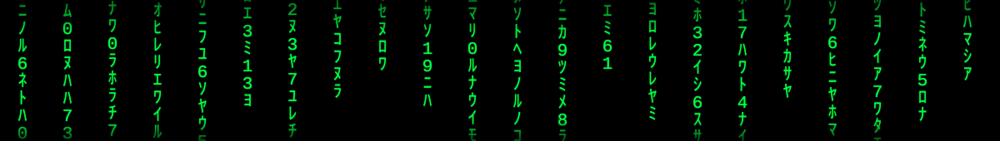

<!-- ═══════════════════════════════════════════════════════════════
     THE MATRIX :: OPERATOR PROFILE  //  ander1044
     ═══════════════════════════════════════════════════════════════ -->



<!-- ───────────────────────────── BOOT LOG ───────────────────────────── -->
```bash
ander1044@nebuchadnezzar:~$ whoami
ander1044  //  Anda Ben

ander1044@nebuchadnezzar:~$ locate operator
Johannesburg, ZA  //  open to remote

ander1044@nebuchadnezzar:~$ cat /etc/status
STATUS.............. jacked in
CLEARANCE........... Arctic Code Vault Contributor
NODE................. WeThinkCode_
SESSION............. indefinite

ander1044@nebuchadnezzar:~$ matrix --version
The Matrix has you.  Follow the white rabbit.  🐇
```

<!-- ──────────────────────────── TYPING ──────────────────────────────── -->
<div align="center">

[](https://github.com/ander1044)

</div>

<!-- ───────────────────────── OPERATOR PROFILE ──────────────────────── -->
## 

```json
{
  "identity": "Anda Ben",
  "node": "Johannesburg, South Africa // open to remote",
  "status": "jacked in",
  "clearance": "Arctic Code Vault Contributor",
  "education": "Software Engineering — WeThinkCode_",
  "credentials": [
    "AZ-900", 
    "API-Security", 
    "Google-Cybersecurity", 
    "Cisco-Ethical-Hacking"
  ],
  "languages": {
    "spoken": "en: C1",
    "syntax": ["bash", "python", "C", "php", "js"]
  }
}
```

<!-- ───────────────────────── LOADED MODULES ───────────────────────── -->
## 

```bash
ander1044@nebuchadnezzar:~$ ls -la /opt/modules/
```

**`drwxr-xr-x :: cybersecurity`** <br>
<br>
**`drwxr-xr-x :: cloud_infra`** <br>
<br>
**`drwxr-xr-x :: observability_sre`** <br>
<br>
**`drwxr-xr-x :: ai_automation`** <br>
<br>
**`drwxr-xr-x :: endpoint_identity`** <br>
<br>
**`drwxr-xr-x :: saas_integrations`** <br>
<br>
**`drwxr-xr-x :: development`** <br>
<br><br>

<!-- ───────────────────────── TELEMETRY ──────────────────────────────── -->
## 

<div align="center">
<table border="0" cellspacing="0" cellpadding="6">
<tr>
<td align="center" width="33%"></td>
<td align="center" width="33%"></td>
<td align="center" width="33%"></td>
</tr>
<tr>
<td align="center" colspan="3"></td>
</tr>
</table>
</div>

<!-- ────────────────────── CONTRIBUTION FEED ────────────────────────── -->
## 

<p align="center"><i>The serpent devours the grid.  The grid rebuilds.</i></p>

<div align="center">

</div>

<!-- ───────────────────────── COMMS LINKS ───────────────────────────── -->
## 

<details>
<summary><b><code>> execute --target github</code></b></summary>

```bash
[+] Initializing handshake...
[+] Bypassing firewall heuristics...
[+] CONNECTION ESTABLISHED: https://github.com/ander1044
```
</details>

<details>
<summary><b><code>> execute --target linkedin</code></b></summary>

```bash
[+] Pinging professional network...
[+] Establishing secure tunnel...
[+] CONNECTION ESTABLISHED: https://www.linkedin.com/in/anda-ben-249472175/
```
</details>

<details>
<summary><b><code>> execute --target twitter</code></b></summary>

```bash
[+] Decrypting micro-broadcast streams...
[+] Routing through proxy network...
[+] CONNECTION ESTABLISHED: https://twitter.com/ben_a1044
```
</details>

<details>
<summary><b><code>> execute --target facebook</code></b></summary>

```bash
[+] Accessing legacy social mainframe...
[+] Scraping operator profile...
[+] CONNECTION ESTABLISHED: https://www.facebook.com/andaben.ander
```
</details>

<details>
<summary><b><code>> execute --target instagram</code></b></summary>

```bash
[+] Downloading visual cache...
[+] Bypassing image recognition filters...
[+] CONNECTION ESTABLISHED: https://www.instagram.com/anda_ben_/
```
</details>

<details>
<summary><b><code>> execute --target email</code></b></summary>

```bash
[+] Opening SMTP relay...
[+] Generating PGP key pair...
[+] Ready to transmit payload to: ander1044@gmail.com
```
</details>
<br>

<!-- ─────────────────────────── FOOTER ──────────────────────────────── -->
<div align="center">


```
   ╔═══════════════════════════════════════════════════════════╗
   ║  The Matrix is a system, Neo.  That system is our enemy.  ║
   ║  But when you're inside, you look around — what do you    ║
   ║  see?  Businessmen, teachers, lawyers, carpenters.  The   ║
   ║  very minds of the people we are trying to save.          ║
   ╚═══════════════════════════════════════════════════════════╝
```

<p><sub><i>Profile architecture by <a href="https://github.com/ander1044">@ander1044</a> // Matrix digital-rain banner © The Wachowskis, re-imagined in SMIL</i></sub></p>

</div>
